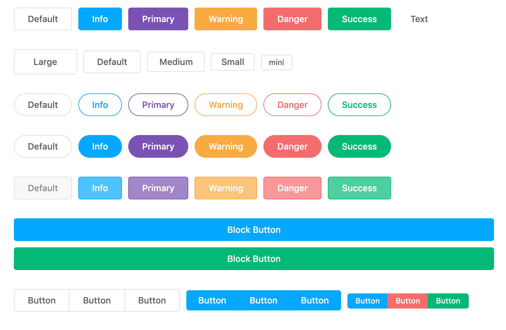

# Button

A button component for vue.

```js
import { Button as VcButton, ButtonGroup as VcButtonGroup } from '@dove-ui/vc-button'
import '@dove-ui/vc-button/dist/index.css'
```

```html
<vc-button>Button</vc-button>

<vc-button-group>
  <vc-button>Button</vc-button>
  <vc-button>Button</vc-button>
</vc-button-group>
```



### Button Attributes


| Attribute   | Description   | Type    | Accepted Values                                                | Default   |
|-------------|---------------|---------|----------------------------------------------------------------|-----------|
| type        | type          | string  | `default`,`info`,`primary`,`warning`,`danger`,`success`,`text` | `default` |
| size        | size          | string  | `large`,`medium`,`samll`,`mini`                                | —         |
| plain       | plain         | boolean | —                                                              | false     |
| round       | round         | boolean | —                                                              | false     |
| disabled    | disabled      | boolean | —                                                              | false     |
| block       | block         | boolean | —                                                              | false     |
| loading     | loading state | boolean | —                                                              | false      |
| native-type | native type   | string  | `button` / `submit` / `reset`                                  | `button`  |
